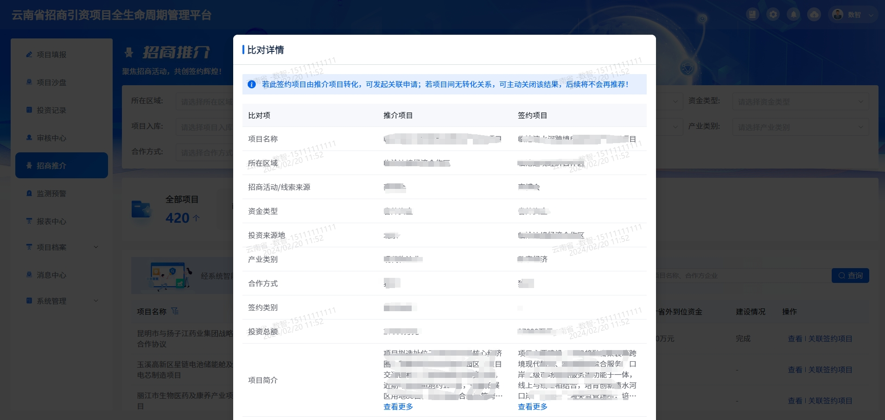

<script setup>
import { ref} from 'vue'
// import table from './table.vue'
</script>

# 对比表格
## 使用说明
ui-table 组件的对比表格的实践。对比表格即表格第一列为对比字段，后续为对比项目。

该文档不支持加载ui-table组件,具体表现请查看云南招商投促项目的招商推介模块中的智能比对。
## 已知有多少个对比项时的对比表格示例
实现思路

1. 确认好表头列

示例图片

接口数据结构

``` ts
{
  data1:{},
  data2:{}
}
```


``` vue
<template>
  <ui-table
    v-bind="tableOptions"
    :data="state.data"
    :columns="useColumns"
    @change="onChange"
    @sort="sortChange"
  >
    <template v-for="(item,index) in useColumns" #[String(item.key)]="{row}" :key="index">
      <template v-if="row.label == '合作方'">
        <template v-if="get(row,item.key,[])">{{ get(row,item.key,[]).map(e=>e.companyName).join(',') }}</template>
        <template v-else>-</template>
      </template>
      <template v-else-if="row.label == '投资总额'">
        <template v-if="item.key == 'recommendResult'">{{ get(row,item.key,'-') }}{{ get(row.recommendResult,'totalInvestUnit','') == '0'?'万元':'万美元' }}</template>
        <template v-else>{{ get(row,item.key,'-') }}万元</template>
      </template>
      <template v-else-if="row.label == '所在区域'">
        {{ getDictValue('13.list',get(row,item.key,''),'valueRange') }}
      </template>
      <template v-else-if="row.label == '投资来源地'">
        {{ getDictValue('13.list', get(row,item.key,''),'valueRange') }}
      </template>
      <template v-else-if="row.label == '项目简介'">
        <div> <ContentMore :max-length="75" :data="get(row,item.key,'')" />  </div>
      </template>
      <template v-else>
        {{ get(row,item.key,'-') || '-' }}
      </template>
    </template>
  </ui-table>
</template>

<script lang="ts" setup>
import { reactive, ref } from 'vue';
import { UiTable } from 'static/lib/entry'

let state = reactive({
  data:[],
  show:false
})

const tableProps = ref({
  border: true,
  height: '100%',
  select: false,
  rowKey: 'id',
  stripe: false,
  currentRowkey: 'id',
  fit:true,
  tooltipEffect:'light',
  showOverflowTooltip:true
})

const pageOptions:any = ref({
  total:0,
  mapper:{
    currentPage:'pageNum',
  },
  props:{
    pageSize:10,
    pageNum:1
  }
})


function comparisonDetailColumn () {
  return [
    { label: '项目名称', key: 'name', },
    {
      label: '所在区域', key: 'county', props: {
        keyMap: {
          recommendResult: 'county',
          signResult: 'areaCode',
        },
      },
    },
    {
      label: '招商活动/线索来源', props: {
        keyMap: {
          recommendResult: 'activityName',
          signResult: 'chooseType14Str',
        },
      }, key: 'activityName',
    },
    { label: '资金类型', key: 'chooseType18Id', transform: '18.list' },
    {
      label: '投资来源地', key: 'investFrom', props: {
        keyMap: {
          recommendResult: 'investFrom',
          signResult: 'partyAFrom',
        },
      }, transform: data => {
        return data
      }
    },
    { label: '产业类别', key: 'chooseType15Id', transform: '15.list' },
    { label: '合作方式', key: 'chooseType17Id', transform: '17.list' },
    { label: '签约类别', key: 'chooseType31Id', transform: '31.list' },
    {
      label: '投资总额', key: 'totalInvestComposition', props: {
        keyMap: {
          recommendResult: 'totalInvestComposition',
          signResult: 'totalInvest',
        },
      }
    },
    {
      label: '项目简介', key: 'briefIntroduction', props: {
        keyMap: {
          recommendResult: 'briefIntroduction',
          signResult: 'content',
        },
      }
    },
    {
      label: '云南方', key: 'ownCompanyName', props: {
        keyMap: {
          recommendResult: 'ownCompanyName',
          signResult: 'partyADeptName',
        },
      }
    },
    {
      label: '合作方', key: 'partnerResults', props: {
        keyMap: {
          recommendResult: 'partnerList',
          signResult: 'partnerResults',
        },
      }
    },
    {
      label: '签约代表（云南方）', key: 'ownDeputy'
    },
    {
      label: '签约代表（合作方）', key: 'partnerDeputy',
    },
    {
      label: '联系人', key: '', props: {
        keyMap: {
          recommendResult: 'contacts',
          signResult: 'partyADeptName',
        },
      }
    },
  ] as FieldItem[]
}
let comparisonOptions = {
  comparisonItems:[
    // key = 接口返回的数据集合Key
    { label:'推介项目',key:'recommendResult' },
    { label:'签约项目',key:'signResult' },
  ]
}
const asyncData = async () => {
  const params: any = Object.assign({},  curParams.value || {},{
    id:row.value.id
  })
  const { success, errMsg, data }: any = await ProjectRecommendSimilarityGetDetail(params)
  if (!success) return ElMessage.error(errMsg)
  state.cloneData = cloneDeep(data)
  // 创建对比表格的表格列
  let useColumn =  [
    { label:'比对项',key:'label',type:''   },
  ].concat(comparisonOptions.comparisonItems.map((item:any)=>{
    item.type = 'slot'
    item.slotName = item.key
    return item
  }))
  // 数据结果
  let processedData:any[] = []
  // 对比列表的左侧对比项,存在一个对比项在数据源中是不一致的Key值,所以做以下处理
  let tableColumn = comparisonDetailColumn()

  let useData:any = []
  let waitingProcessdColumns:{
    [x:string]:any []
  } = {}
  tableColumn.forEach(item=>{
    let obj = {  label:item.label,key:item.key  }
    set(obj,'props',get(item,'props'))
    let cloneDeepItem = cloneDeep(item)
    comparisonOptions.comparisonItems.map(comparisonItem=>{
      set(obj,`${comparisonItem.key}_key`,get(item,`props.keyMap.${comparisonItem.key}`,item.key))
      cloneDeepItem.key = get(item,`props.keyMap.${comparisonItem.key}`,item.key)
      waitingProcessdColumns[comparisonItem.key] = waitingProcessdColumns[comparisonItem.key] || []
      waitingProcessdColumns[comparisonItem.key].push(cloneDeepItem)
    })
    processedData.push(obj)
  })
  Object.keys(waitingProcessdColumns).forEach(key=>{
    let columns = waitingProcessdColumns[key]
    useData.push(transformTableData(columns, [data[key]]))
  })
  comparisonOptions.comparisonItems.forEach((comparisonItem,index)=>{
    let key = comparisonItem.key
    let dataItem = get(useData,`${index}.0`)
    processedData.map(processItem=>{
      set(processItem,key,get(dataItem,get(processItem,`${key}_key`),''))
      set(processItem,`${key}_extInfo`,processItem)
    })
  })
  state.data = processedData
  state.columns = useColumn
}

</script>

<style lang="scss" scoped>
 
</style>

```